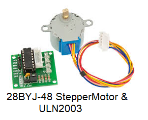

28BYJ-48
========

A few examples on how to contrlole the 28BYJ-48 stepper motore with the ULN2003 driver on the Beaglebone Black

| Board pin name | Board pin | Beaglebone Black pin name |
|----------------|-----------| --------------------------|
| IN1            | 1         | P8\_8, GPIO               |
| IN2            | 2         | P8\_10, GPIO              |
| IN3            | 3         | P8\_12, GPIO              |
| IN4            | 4         | P8\_14, GPIO              |
|                |           |                           |
| 5V             |           |                           |
| -              | 1         | External Power Negitive   |
| +              | 2         | External Power Positive   |

